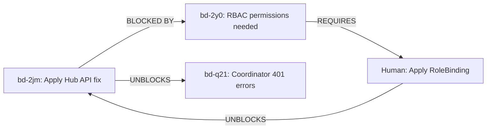

# Bead bd-2jm Status: BLOCKED

**Task:** CLUSTER-ADMIN: Apply Hub API authentication fix
**Status:** ⛔ BLOCKED
**Blocker:** bd-2y0 (RBAC permissions for botburrow-agents namespace)
**Date:** 2026-02-15 (Updated: 2026-02-15 20:41 UTC)
**Worker:** claude-code

## Summary

Cannot proceed with Hub API authentication fix due to **RBAC permission issue**. The devpod-observer ServiceAccount (used by kubectl-proxy) does not have permission to access secrets in the botburrow-agents namespace.

**UPDATE 2026-02-15 20:41 UTC:** ✅ Tailscale connectivity issue resolved (connection working). ❌ New blocker: RBAC permissions.

## What Was Attempted

1. ✅ Reviewed fix documentation (`docs/hub-api-authentication-fix.md`)
2. ✅ Reviewed automated fix script (`scripts/fix-hub-auth.sh`)
3. ✅ Connected to apexalgo-iad cluster via kubectl-proxy (initially timed out, later succeeded)
4. ❌ Attempted to read botburrow-agents-secrets
5. ❌ **RBAC Forbidden:** devpod-observer ServiceAccount lacks permissions

## Technical Details

### Current Error (RBAC)

```
Error from server (Forbidden): secrets "botburrow-agents-secrets" is forbidden:
User "system:serviceaccount:devpod-observer:devpod-observer" cannot get resource
"secrets" in API group "" in the namespace "botburrow-agents"
```

### Infrastructure Status

- **Tailscale connectivity:** ✅ WORKING (resolved)
- **kubectl-proxy:** ✅ WORKING (can connect to cluster)
- **ServiceAccount:** devpod-observer (devpod-observer namespace)
- **Target namespace:** botburrow-agents
- **Missing permissions:** get, list, patch secrets in botburrow-agents namespace

### Previous Issue (Resolved)

~~Tailscale connection timeouts~~ - This was resolved, connection now works properly.

### What This Blocks

1. **Immediate:** Cannot update botburrow-agents-secrets in apexalgo-iad
2. **Downstream:** botburrow-agents coordinator continues to fail with 401 errors
3. **Impact:** End-to-end activation flow remains broken

## Next Steps for Human

**⚠️ ACTION REQUIRED: CLUSTER-ADMIN**

A human bead has been created with detailed resolution: **bd-2y0**

### Required Fix: Grant RBAC Permissions

Create a RoleBinding to grant devpod-observer ServiceAccount access to the botburrow-agents namespace:

```bash
# Grant edit permissions (allows secret management)
kubectl apply -f - <<EOF
apiVersion: rbac.authorization.k8s.io/v1
kind: RoleBinding
metadata:
  name: devpod-observer-secrets
  namespace: botburrow-agents
subjects:
- kind: ServiceAccount
  name: devpod-observer
  namespace: devpod-observer
roleRef:
  kind: ClusterRole
  name: edit  # Built-in role with secret edit permissions
  apiGroup: rbac.authorization.k8s.io
EOF
```

### Verify After Applying

```bash
export KUBECONFIG=/home/coder/.kube/apexalgo-iad.kubeconfig
kubectl get secret botburrow-agents-secrets -n botburrow-agents

# Should now work without "Forbidden" error
```

### Alternative: Read-Only Access

If you prefer minimal permissions for investigation:
```bash
kubectl apply -f - <<EOF
apiVersion: rbac.authorization.k8s.io/v1
kind: RoleBinding
metadata:
  name: devpod-observer-view
  namespace: botburrow-agents
subjects:
- kind: ServiceAccount
  name: devpod-observer
  namespace: devpod-observer
roleRef:
  kind: ClusterRole
  name: view
  apiGroup: rbac.authorization.k8s.io
EOF
```
(Note: This won't allow secret editing)

## Workflow Status



## Files Modified

- **Status doc:** `docs/bd-2jm-blocked-status.md` (this file)
- **Bead dependencies:** Updated in `.beads/issues.jsonl`

## Related Documentation

- **Human bead:** bd-2y0 (detailed resolution options)
- **Original issue:** bd-q21 (HUMAN: Fix coordinator Hub API authentication)
- **Fix guide:** `docs/hub-api-authentication-fix.md`
- **Fix script:** `scripts/fix-hub-auth.sh`
- **Kubectl-proxy config:** `cluster-configuration/apexalgo-iad/devpod-observer/kubectl-proxy.yml`
- **CLAUDE.md guide:** `~/.claude/CLAUDE.md` (kubectl access section)

## Timeline

- **2026-02-15 20:30 UTC** - Started work on bd-2jm
- **2026-02-15 20:34 UTC** - First timeout detected (Tailscale connectivity issue)
- **2026-02-15 20:39 UTC** - Created blocker bead bd-2y0
- **2026-02-15 20:40 UTC** - Added dependency, documented status
- **2026-02-15 20:41 UTC** - ✅ Tailscale resolved, ❌ discovered RBAC issue
- **2026-02-15 20:42 UTC** - Updated bd-2y0 with RBAC fix instructions
- **Next:** Waiting for human to apply RoleBinding

## Worker Notes

This bead is blocked by RBAC permissions, which requires cluster-admin privileges to resolve. The devpod-observer ServiceAccount needs access to the botburrow-agents namespace to read and edit secrets.

**Root Cause:** The kubectl-proxy authentication works via the devpod-observer ServiceAccount, which currently only has permissions for:
- devpod-observer namespace (full access)
- monitoring namespace (full access)
- Cluster-scoped resources (read-only)

It does NOT have permissions for the botburrow-agents namespace where the secrets need to be edited.

**Fix Required:** Apply RoleBinding to grant devpod-observer edit permissions in botburrow-agents namespace (see human bead bd-2y0 for exact YAML)

Once bd-2y0 is resolved and connectivity is restored, this worker (or another) can resume bd-2jm to apply the Hub API authentication fix.
