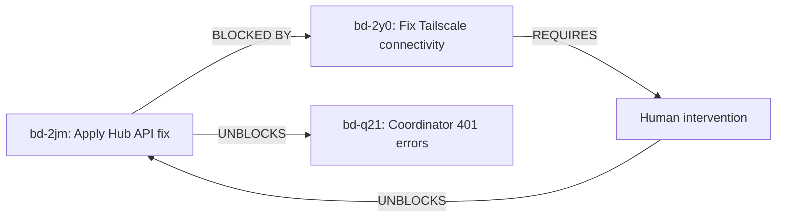

# Bead bd-2jm Status: BLOCKED

**Task:** CLUSTER-ADMIN: Apply Hub API authentication fix
**Status:** ⛔ BLOCKED
**Blocker:** bd-2y0 (CLUSTER-ADMIN: Fix Tailscale kubectl-proxy connectivity to apexalgo-iad)
**Date:** 2026-02-15
**Worker:** claude-code

## Summary

Cannot proceed with Hub API authentication fix because the Tailscale kubectl-proxy connection to apexalgo-iad cluster is experiencing timeout issues. This is a **cluster infrastructure problem** that requires human intervention.

## What Was Attempted

1. ✅ Reviewed fix documentation (`docs/hub-api-authentication-fix.md`)
2. ✅ Reviewed automated fix script (`scripts/fix-hub-auth.sh`)
3. ❌ Attempted to connect to apexalgo-iad cluster via kubectl-proxy
4. ❌ Connection timed out after 90+ seconds

## Technical Details

### Error Symptoms

```
# kubectl error
E0215 20:37:15.763511 2879290 memcache.go:265] "Unhandled Error"
err="couldn't get current server API group list: Get
\"http://ts-kubectl-apexalgo-iad-87pxw.tailscale.svc.cluster.local:8001/api?timeout=32s\":
dial tcp 10.42.6.45:8001: i/o timeout"

# Tailscale pod logs
2026/02/15 20:38:03 open-conn-track: timeout opening
(TCP 100.79.107.110:37196 => 100.94.193.51:8001) to node [p/guc];
online=yes, lastRecv=13m42s
```

### Infrastructure Status

- **Tailscale pod:** ts-kubectl-apexalgo-iad-87pxw-0 (Running, age: 3d17h)
- **Service:** kubectl-apexalgo-iad.devpod.svc.cluster.local:8001
- **Issue:** TCP connection to remote node 100.94.193.51:8001 times out
- **Tailscale status:** Shows "online=yes" but cannot establish connections

### What This Blocks

1. **Immediate:** Cannot update botburrow-agents-secrets in apexalgo-iad
2. **Downstream:** botburrow-agents coordinator continues to fail with 401 errors
3. **Impact:** End-to-end activation flow remains broken

## Next Steps for Human

**⚠️ ACTION REQUIRED: CLUSTER-ADMIN**

A human bead has been created with detailed resolution options: **bd-2y0**

### Recommended Quick Fix (Option 1)

Restart the Tailscale proxy pod to see if it's a transient connection issue:

```bash
# Restart Tailscale proxy pod
kubectl delete pod -n tailscale ts-kubectl-apexalgo-iad-87pxw-0

# Wait for pod to restart
kubectl wait --for=condition=Ready pod -n tailscale \
  -l app.kubernetes.io/name=ts-kubectl-apexalgo-iad --timeout=120s

# Test connectivity
curl http://kubectl-apexalgo-iad.devpod.svc.cluster.local:8001/healthz

# Should return: "ok"
```

### If Quick Fix Doesn't Work

See human bead **bd-2y0** for additional diagnostic steps including:
- Checking Tailscale mesh connectivity
- Verifying remote kubectl-proxy health in apexalgo-iad
- Alternative access methods via VPN/bastion

## Workflow Status



## Files Modified

- **Status doc:** `docs/bd-2jm-blocked-status.md` (this file)
- **Bead dependencies:** Updated in `.beads/issues.jsonl`

## Related Documentation

- **Human bead:** bd-2y0 (detailed resolution options)
- **Original issue:** bd-q21 (HUMAN: Fix coordinator Hub API authentication)
- **Fix guide:** `docs/hub-api-authentication-fix.md`
- **Fix script:** `scripts/fix-hub-auth.sh`
- **Kubectl-proxy config:** `cluster-configuration/apexalgo-iad/devpod-observer/kubectl-proxy.yml`
- **CLAUDE.md guide:** `~/.claude/CLAUDE.md` (kubectl access section)

## Timeline

- **2026-02-15 20:30 UTC** - Started work on bd-2jm
- **2026-02-15 20:34 UTC** - First timeout detected
- **2026-02-15 20:39 UTC** - Created blocker bead bd-2y0
- **2026-02-15 20:40 UTC** - Added dependency, documented status
- **Next:** Waiting for human to resolve Tailscale connectivity

## Worker Notes

This is a cluster infrastructure issue beyond the scope of autonomous worker operations. The Tailscale mesh connection appears to be in a degraded state where it reports "online" but cannot establish TCP connections to the remote kubectl-proxy.

The fix requires cluster-admin privileges to either:
1. Restart the Tailscale proxy pod
2. Investigate Tailscale mesh routing issues
3. Use alternative cluster access methods

Once bd-2y0 is resolved and connectivity is restored, this worker (or another) can resume bd-2jm to apply the Hub API authentication fix.
